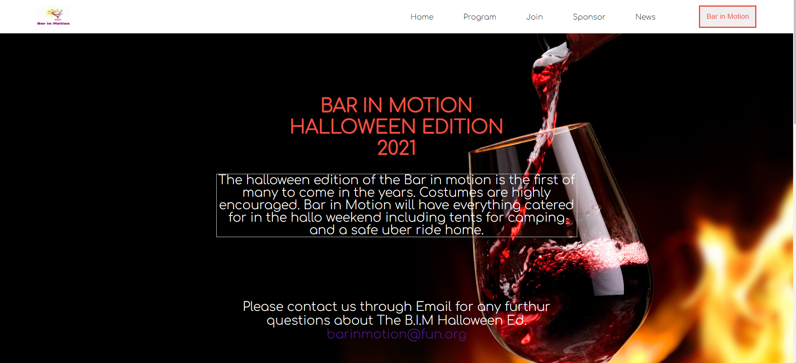

# The Module One Capstone Project

> The BAR IN MOTION website project was created per the Cindy Shin design in Behance. The website project is regarding an event and communicates important details about the event and more about the event's host. (BAR IN MOTION INC.)

## Mobile Version screenshot


## Desktop Version screenshot



Additional description of the project and its features.

## Live Demo

[Live Demo Link](https://mosams.github.io/Module-One-Capstone-Project/)

## Built With

- HTML
- CSS
- JAVASCRIPT

## How to Setup
> You can clone or download [this repository](https://github.com/Mosams/Module-One-Capstone-Project.git), and use your favorite browser or code editor to run this program.

- To open the project after download, simply double-click the index.html file

- To open this project using vs code ( for this example) or your favorite code editor, you can follow the guide below:
> In your cmd or command line navigate to where this project is located, then;
```cmd
cd microverse_portfolio_project 
```
> thereafter run
```cmd
code .
```

## Authors

👤 **Author1**

- GitHub: [@githubhandle](https://github.com/Mosams/)
- Twitter: [@twitterhandle](https://twitter.com/sam_mongare)
- LinkedIn: [LinkedIn](https://www.linkedin.com/in/sammy-mongare-b8288310b/)

## 🤝 Contributing

Contributions, issues, and feature requests are welcome!

Feel free to check the [issues page](../../issues/).

## Show your support

Give a ⭐️ if you like this project!

## Acknowledgments
- Design idea by [Cindy Shin in Behance](https://www.behance.net/adagio07).
- Icons from [Iconscout](https://iconscout.com). 
